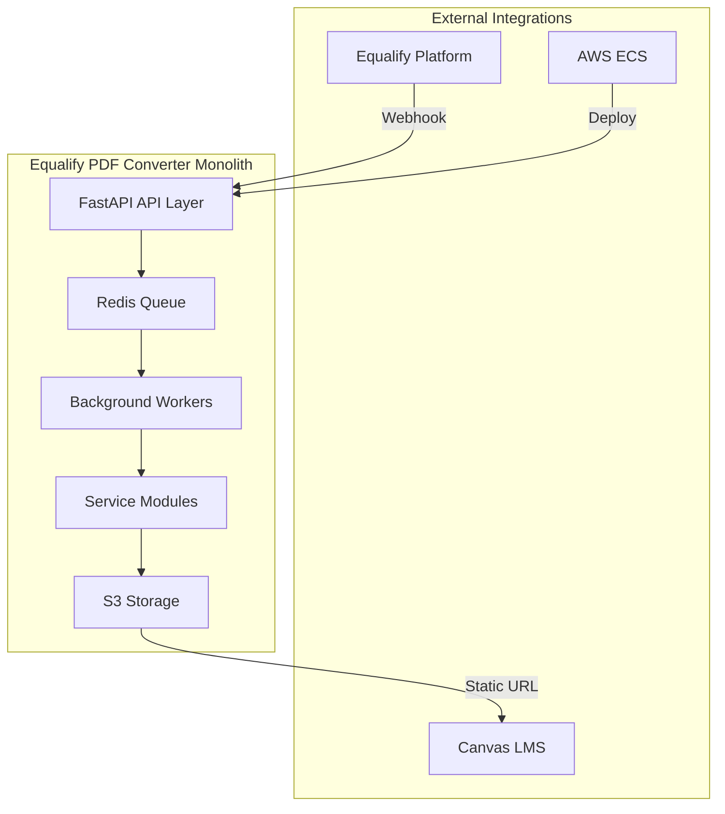

# PRD-010: End-to-End Integration & Testing

## Document Information
- **PRD ID**: PRD-010
- **Title**: End-to-End Integration & Testing
- **Phase**: Phase 3 - Integration
- **Priority**: P0 (Critical)
- **Estimated Effort**: 2 days
- **Dependencies**: All Phase 1 and Phase 2 PRDs (PRD-001 through PRD-008), PRD-009A (Grafana Observability), PRD-009B (Demo REST UI)
- **Cannot be done in parallel**: Must be done last after all other components

## Executive Summary

Complete system integration that validates the entire PDF-to-semantic-markup pipeline works seamlessly across all services. This PRD establishes the comprehensive testing framework, performance benchmarks, monitoring infrastructure, and production readiness validation required for the Equalify PDF Converter MVP.

## Problem Statement

While individual modules have been developed and tested in isolation, the complete system integration represents the highest risk area for the MVP. Without comprehensive end-to-end validation, production deployments may fail due to:
- Module communication failures
- Queue processing bottlenecks
- Resource contention issues
- Configuration inconsistencies
- Performance degradation under load
- Missing error handling paths

## Business Context

### Success Criteria from CLAUDE.md
- **Processing cost**: ~$0.20 per document target
- **Processing time**: 2-8 minutes for typical documents
- **Structure accuracy**: ≥90% proper heading hierarchy preservation
- **Faculty review time**: ≤10 minutes for 10-page document

### UIC Integration Requirements
- **AWS ECS**: Infrastructure deployment readiness

## Goals and Objectives

### Primary Goals
1. **Complete System Integration**: All modules working together seamlessly in the monolith
2. **Performance Validation**: Meet all processing time and cost targets
3. **Production Readiness**: Full monitoring, health checks, and error handling

### Secondary Goals
1. **Operational Excellence**: Comprehensive documentation and runbooks
2. **Scalability Validation**: System performance under expected load
3. **Reliability Assurance**: Error recovery and fault tolerance testing

## Technical Requirements

### Integration Architecture


### Infrastructure Configuration
- **Docker Compose**: Infrastructure services (Redis, LocalStack) with proper networking
- **Volume management**: Persistent storage for Redis and temporary processing
- **Environment configuration**: Consistent secrets and configuration management
- **Health check integration**: Application and infrastructure health probes

### Module Communication Validation
- **API Layer**: Request routing and endpoint functionality
- **Message Queues**: Redis task queue reliability
- **Data Flow**: PDF → Markdown → MDX → HTML pipeline integrity within monolith
- **Error Propagation**: Failure handling across module boundaries

## Functional Requirements

### FR-001: End-to-End Processing Workflows
- **Complete PDF Processing**: Upload → Convert → Enhance → Render → Deploy
- **Webhook Integration**: Equalify platform trigger validation
- **Canvas Integration**: External URL module deployment
- **Status Tracking**: Real-time processing status across all stages

### FR-002: Performance Benchmarking
- **Processing Time Validation**: 2-8 minutes for typical documents
- **Cost Analysis**: $0.20 per document target validation
- **Resource Utilization**: CPU, memory, and storage monitoring
- **Concurrent Processing**: Multi-document handling capacity

### FR-003: Quality Assurance Integration
- **Accuracy Validation**: ≥90% structure preservation testing
- **Accessibility Compliance**: WCAG 2.1 AA validation pipeline
- **Confidence Scoring**: High/Medium/Low classification accuracy
- **Faculty Review Workflow**: Complete review interface testing

### FR-004: Error Handling and Recovery
- **Service Failure Recovery**: Graceful degradation and restart
- **Queue Management**: Dead letter queues and retry logic
- **Data Consistency**: Transaction integrity across services
- **User Notification**: Error status communication

## Non-Functional Requirements

### Performance Requirements
- **Throughput**: Process minimum 10 concurrent documents
- **Response Time**: API endpoints < 200ms for status queries
- **Queue Processing**: <30 seconds queue latency
- **Resource Limits**: Define CPU/memory constraints per service

### Reliability Requirements
- **Uptime**: 99.9% availability target
- **Data Durability**: Zero document loss during processing
- **Fault Tolerance**: Single service failure recovery
- **Backup Strategy**: S3 cross-region replication validation

### Scalability Requirements
- **Horizontal Scaling**: Container scaling validation
- **Load Distribution**: Queue-based load balancing
- **Storage Growth**: S3 storage pattern optimization
- **Database Performance**: Redis performance under load

### Security Requirements
- **PII Protection**: Microsoft Presidio integration validation
- **Data Encryption**: In-transit and at-rest encryption
- **Access Control**: Service-to-service authentication
- **Audit Logging**: Complete processing audit trails

## Test Strategy

### Integration Test Categories

#### 1. Module Integration Tests
```python
# Example test structure
class TestModuleIntegration:
    def test_api_to_processing_communication(self)
    def test_processing_pipeline_flow(self)
    def test_worker_queue_integration(self)
    def test_storage_deployment(self)
    def test_cross_module_error_handling(self)
```

#### 2. End-to-End Workflow Tests
```python
class TestEndToEndWorkflows:
    def test_complete_pdf_processing_pipeline(self)
    def test_faculty_review_workflow(self)
    def test_document_versioning_system(self)
```

#### 3. Performance and Load Tests
```python
class TestPerformanceAndLoad:
    def test_concurrent_document_processing(self)
    def test_processing_time_benchmarks(self)
    def test_resource_utilization_limits(self)
    def test_queue_throughput_capacity(self)
    def test_storage_performance_patterns(self)
```

#### 4. Production Readiness Tests
```python
class TestProductionReadiness:
    def test_health_check_endpoints(self)
    def test_monitoring_and_alerting(self)
    def test_log_aggregation_system(self)
    def test_deployment_automation(self)
    def test_disaster_recovery_procedures(self)
```

### Test Data Requirements
- **Sample PDFs**: 10+ diverse documents covering edge cases
- **Performance Baselines**: Documented expected processing times
- **Error Scenarios**: Comprehensive failure mode catalog

## Monitoring and Observability

**NOTE**: Monitoring infrastructure is implemented in PRD-009A (Grafana Observability Stack). This PRD validates that monitoring works correctly for integration testing.

### System Health Monitoring
```yaml
# Health check configuration (from PRD-009A)
health_checks:
  fastapi_application:
    endpoint: /health
    interval: 30s
    timeout: 10s
    checks:
      - redis_connection
      - s3_access
      - worker_status
```

### Performance Metrics
- **Processing Pipeline Metrics**: Document throughput, processing time distribution
- **Queue Metrics**: Queue depth, processing rate, error rate
- **Resource Metrics**: CPU utilization, memory usage, disk I/O
- **Business Metrics**: Cost per document, accuracy rates, user satisfaction

### Alerting Strategy
- **Critical Alerts**: Service failures, queue backlogs >5 minutes
- **Warning Alerts**: High resource utilization, processing time increases
- **Info Alerts**: Successful deployments, configuration changes

### Log Aggregation
```python
# Structured logging format
log_format = {
    "timestamp": "2024-01-15T10:30:00Z",
    "service": "processing_service",
    "level": "INFO",
    "message": "Document processing completed",
    "document_id": "doc_123",
    "processing_time": 180.5,
    "confidence_score": 0.87
}
```

## Deployment and Operations

### Production Deployment Configuration
```yaml
# Production deployment uses a single container with the monolith
# Infrastructure services (Redis) run in separate containers
version: '3.8'
services:
  redis:
    image: redis:7-alpine
    volumes:
      - redis_data:/data

  pdf-converter:
    image: equalify-pdf-converter:latest
    deploy:
      resources:
        limits:
          cpus: '2.0'
          memory: 4G
    healthcheck:
      test: ["CMD", "curl", "-f", "http://localhost:8000/health"]
      interval: 30s
      timeout: 10s
      retries: 3
    depends_on:
      - redis
```

### Infrastructure as Code
- **AWS ECS Task Definitions**: Complete service definitions
- **VPC Configuration**: Network security and isolation
- **Load Balancer Setup**: Traffic distribution and SSL termination
- **Auto Scaling Policies**: Resource scaling rules

### Deployment Automation
```bash
# Deployment script structure
#!/bin/bash
deploy_equalify_pdf_converter() {
    validate_environment
    build_and_push_images
    update_ecs_services
    run_integration_tests
    validate_health_checks
    notify_deployment_status
}
```

## Documentation Requirements

### 1. Deployment Documentation
- **Environment Setup**: Step-by-step deployment instructions
- **Configuration Management**: Environment variables and secrets
- **Service Dependencies**: Startup order and health checks
- **Troubleshooting Guide**: Common issues and resolutions

### 2. Operational Runbooks
- **Service Management**: Start, stop, restart procedures
- **Monitoring Procedures**: Health check interpretation
- **Incident Response**: Failure diagnosis and recovery
- **Maintenance Tasks**: Regular operational procedures

### 3. Testing Documentation
- **Test Execution**: How to run integration test suite
- **Performance Benchmarks**: Expected performance baselines
- **Test Data Management**: Sample document preparation
- **Result Interpretation**: Understanding test outcomes

### 4. API Documentation
- **Complete API Reference**: All endpoints with examples
- **Integration Guides**: Equalify and Canvas integration
- **Error Codes**: Comprehensive error handling documentation
- **Rate Limiting**: Usage limits and best practices

## Acceptance Criteria

### AC-001: Complete System Integration
- [ ] Monolith application with all modules integrated and running
- [ ] Full PDF-to-HTML pipeline processing sample documents
- [ ] Webhook integration with Equalify platform mock
- [ ] Canvas LMS external URL integration validated
- [ ] Infrastructure and application startup working correctly

### AC-002: Performance Benchmarks Met
- [ ] Processing time: 2-8 minutes for typical 10-page documents
- [ ] Processing cost: ≤$0.25 per document (allowing 25% buffer)
- [ ] Concurrent processing: Minimum 10 documents simultaneously
- [ ] API response times: <200ms for status endpoints
- [ ] Queue processing latency: <30 seconds average

### AC-003: Quality Assurance Validation
- [ ] Structure accuracy: ≥90% heading hierarchy preservation
- [ ] Confidence scoring: Accurate High/Medium/Low classification
- [ ] Faculty review workflow: Complete 10-minute review simulation
- [ ] Accessibility testing: Screen reader compatibility validated

### AC-004: Production Readiness
- [ ] Health check endpoints: Application responding correctly
- [ ] Monitoring dashboard: Real-time metrics visualization
- [ ] Error handling: Graceful failure recovery demonstrated
- [ ] Log aggregation: Centralized structured logging working
- [ ] Deployment automation: One-command deployment successful

### AC-005: Integration Testing Suite
- [ ] End-to-end test coverage: >80% critical path coverage
- [ ] Performance test suite: Load testing up to 50 concurrent users
- [ ] Error scenario testing: All failure modes tested
- [ ] Regression test suite: Automated testing for future changes
- [ ] Test data management: Comprehensive sample document library

### AC-006: Documentation Completeness
- [ ] Deployment guide: Step-by-step instructions validated
- [ ] Operational runbook: All procedures documented and tested
- [ ] API documentation: Complete with working examples
- [ ] Troubleshooting guide: Common issues and solutions documented
- [ ] Performance baselines: Documented expected metrics

### AC-007: Security and Compliance
- [ ] PII scanning: Microsoft Presidio integration validated
- [ ] Data encryption: All data encrypted in transit and at rest
- [ ] Access control: Service-to-service authentication working
- [ ] Audit logging: Complete processing trails captured
- [ ] Compliance validation: WCAG 2.1 AA requirements met

## Deliverables

### 1. Integration Infrastructure
- **File**: `/docker-compose.yml`
- **Content**: Infrastructure services (Redis, LocalStack)
- **File**: `/Dockerfile`
- **Content**: Production container image for monolith application

### 2. Comprehensive Test Suite
- **Directory**: `/tests/integration/`
- **Files**:
  - `test_end_to_end_workflows.py`
  - `test_module_integration.py`
  - `test_performance_benchmarks.py`
  - `test_production_readiness.py`
- **Coverage**: >80% critical path coverage

### 3. Monitoring and Observability
- **Directory**: `/monitoring/`
- **Files**:
  - `docker-compose.monitoring.yml`
  - `prometheus.yml`
  - `grafana-dashboards/`
  - `alerting-rules.yml`
- **Features**: Complete monitoring stack

### 4. Documentation Package
- **Directory**: `/docs/operations/`
- **Files**:
  - `deployment-guide.md`
  - `operational-runbook.md`
  - `troubleshooting-guide.md`
  - `api-reference.md`
  - `performance-baselines.md`

### 5. Deployment Automation
- **Directory**: `/scripts/deployment/`
- **Files**:
  - `deploy.sh`
  - `validate-deployment.sh`
  - `rollback.sh`
  - `health-check.sh`
- **Features**: One-command deployment and validation

### 6. Performance Benchmarking
- **Directory**: `/benchmarks/`
- **Files**:
  - `performance-test-suite.py`
  - `load-test-scenarios/`
  - `baseline-metrics.json`
  - `cost-analysis.xlsx`
- **Output**: Validated performance against targets

## Risk Assessment

### High-Risk Areas
1. **Module Communication**: Internal communication between modules
2. **Performance Bottlenecks**: Queue processing under load
3. **Resource Contention**: Multiple workers competing for resources
4. **Configuration Complexity**: Environment-specific settings

### Mitigation Strategies
1. **Comprehensive Testing**: Extensive integration test coverage
2. **Monitoring Infrastructure**: Real-time visibility into all services
3. **Gradual Rollout**: Phased deployment with rollback capability
4. **Documentation**: Detailed operational procedures and troubleshooting

### Success Metrics
- **Integration Success Rate**: 100% successful end-to-end processing
- **Performance Compliance**: All benchmarks met within tolerances
- **Documentation Quality**: Zero deployment issues following guides
- **Operational Readiness**: Sub-5-minute incident response capability

## Timeline

### Day 1: Integration and Testing
- **Morning**: Docker Compose orchestration setup
- **Afternoon**: End-to-end workflow testing
- **Evening**: Performance benchmarking and optimization

### Day 2: Production Readiness
- **Morning**: Monitoring and observability setup
- **Afternoon**: Documentation completion and validation
- **Evening**: Final acceptance criteria validation and sign-off

## Dependencies

### Required Completions
- **PRD-001**: Core PDF Processing Service (complete)
- **PRD-002**: AI Enhancement Pipeline (complete)
- **PRD-003**: Accessible HTML Rendering (complete)
- **PRD-004**: API Gateway and Orchestration (complete)
- **PRD-005**: Canvas LMS Integration (complete)
- **PRD-006**: Quality Assurance Framework (complete)
- **PRD-007**: Infrastructure and Deployment (complete)

### External Dependencies
- **AWS ECS Cluster**: Production deployment target
- **Equalify Platform**: Webhook integration testing
- **Canvas LMS Instance**: Integration validation environment
- **Performance Testing Tools**: Load testing infrastructure

## Success Definition

The End-to-End Integration & Testing PRD will be considered successful when:

1. **Complete System Integration**: All modules working together seamlessly in the monolith
2. **Performance Targets Met**: All processing time and cost benchmarks achieved
3. **Production Ready**: Full monitoring, documentation, and deployment automation
4. **Quality Validated**: WCAG 2.1 AA compliance and accuracy targets met
5. **Operationally Sound**: Team can deploy, monitor, and maintain the system

This represents the final milestone for the Equalify PDF Converter MVP, ensuring the system is ready for production deployment and can reliably serve UIC's accessibility enhancement needs.