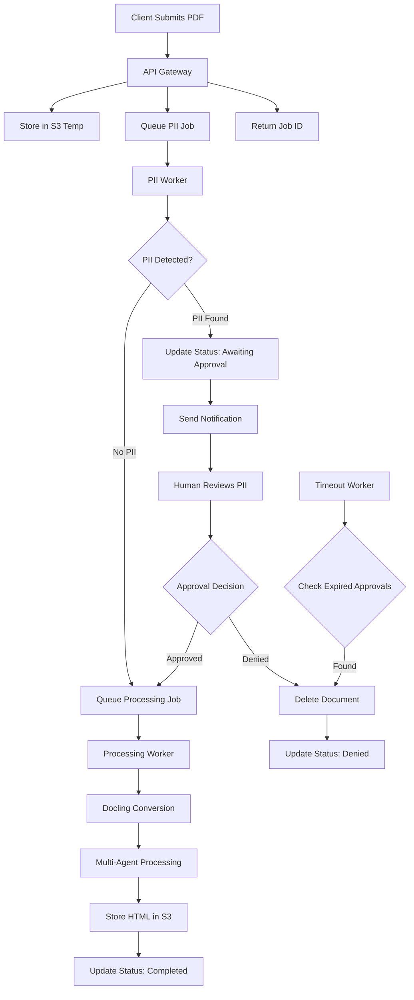

# Equalify PDF Converter - Program Flow Architecture

## System Overview

The Equalify PDF Converter uses a two-stage queue architecture with human approval for PII-detected documents. This ensures security compliance while maintaining non-blocking API performance.

## High-Level Program Flow



## Stage 1: Document Submission

### Description
Client submits PDF document via API. System immediately stores document in temporary S3 location and queues for PII scanning.

### Data Models
```python
# What client sends
SubmissionRequest:
  file: binary

# What we return immediately
JobResponse:
  job_id: str
  status: "pii_scanning"
```

### Edge Cases
- **File too large**: Reject documents >100MB at API level
- **Invalid PDF**: Basic PDF validation before S3 upload
- **Storage failure**: Return 503 if S3 upload fails
- **Duplicate submission**: Generate new job_id for each submission

### Reasoning
- Fast API response (<100ms) critical for UX
- Temporary S3 storage isolates unvalidated content
- Job ID enables asynchronous status tracking

## Stage 2: PII Detection & Scanning

### Description
Dedicated PII worker processes documents using Microsoft Presidio. Documents with no PII proceed directly to processing. Documents with detected PII enter approval workflow.

### Data Models
```python
# What Presidio returns (based on actual output)
PIIFinding:
  entity_type: str     # "PERSON", "EMAIL_ADDRESS", "PHONE_NUMBER"
  start: int           # character position
  end: int             # character position
  score: float         # 0.0-1.0

# What we store in Redis when PII detected
PIIDetected:
  job_id: str
  findings: List[PIIFinding]  # Direct from Presidio
  approval_token: str         # For secure approval URL
  expires_at: timestamp       # Auto-cleanup time
```

### Edge Cases
- **PII scan timeout**: Retry once, then mark as failed
- **Presidio service unavailable**: Queue for retry with exponential backoff
- **False positives**: Common patterns (e.g., "CS 101") added to allowlist
- **Scan errors**: Log error, mark document as failed with specific reason

### Reasoning
- **Separate worker**: PII scanning has different resource requirements than PDF processing
- **Hard security boundary**: No document proceeds without PII validation
- **Confidence scoring**: Allows for threshold-based auto-approval in future versions
- **Presidio choice**: Industry standard, configurable detection rules

## Stage 3: Human Approval Workflow

### Description
When PII is detected, document processing pauses for human review. Faculty receive notification with PII details and approval interface. Approval decisions include justification for audit trail.

### Data Models
```python
# What faculty sends back
ApprovalRequest:
  job_id: str
  decision: "approved" | "denied"
  justification: str?  # Optional explanation
```

### Edge Cases
- **Approval timeout**: Auto-cleanup after 4 hours, delete document and temp files
- **Invalid token**: Reject approval attempts with expired/invalid tokens
- **Double approval**: First valid approval wins, subsequent attempts ignored
- **Email delivery failure**: Log warning, but don't block process (user can check status)
- **Network outages during approval**: Approval state persists in Redis

### Reasoning
- **Human oversight**: Faculty best positioned to evaluate course material context
- **Time bounds**: Prevents documents lingering indefinitely in approval state
- **Secure tokens**: Approval URLs can't be guessed or shared inappropriately
- **Audit trail**: All approval decisions logged with justification

## Stage 4: Document Processing

### Description
Approved documents (or clean documents bypassing approval) enter multi-agent processing pipeline. Conversion from PDF to accessible HTML with semantic enhancement.

### Data Models
```python
# What goes into processing queue (minimal)
ProcessingJob:
  job_id: str
  s3_key: str

# What we store when complete
ProcessingResult:
  job_id: str
  status: "completed" | "failed"
  html_url: str?               # Only if completed
  confidence_score: float?     # Overall quality score
  error_message: str?          # Only if failed
```

### Edge Cases
- **Processing timeout**: Kill job after 10 minutes, mark as failed
- **Agent failures**: Individual agent failures logged, processing continues with degraded confidence
- **S3 upload failure**: Retry 3 times, then mark job as failed
- **Memory limits**: Large documents chunked to prevent OOM errors
- **Malformed PDF**: Docling failures handled gracefully with error reporting

### Reasoning
- **Multi-agent approach**: Specialized agents for different aspects of accessibility
- **Confidence scoring**: Transparent quality assessment for faculty review
- **Semantic caching**: Decision transparency enables learning and corrections
- **Separate processing queue**: Ensures only validated documents reach AI models

## Stage 5: Result Delivery & Storage

### Description
Processed documents stored in public S3 bucket with versioned URLs. Accessibility reports generated. Job status updated to completed with result URLs.

### Data Models
```python
# Final response to client
ProcessingComplete:
  job_id: str
  status: "completed"
  html_url: str,
  mdx_url: str,
  confidence_score: float
  review_recommended: boolean
  processing_time_seconds: number
```

### Edge Cases
- **Storage quota exceeded**: Alert administrators, queue document for cleanup
- **URL generation failure**: Fallback to direct S3 URLs
- **Report generation errors**: Mark document as completed but flag report as unavailable

### Reasoning
- **Permanent URLs**: Academic citation requirements
- **Public storage**: Course materials are inherently shareable
- **Versioning**: Supports document updates and revision tracking
- **Performance reporting**: Processing time tracking for optimization

## Background Services

### Timeout Cleanup Worker

**Description**: Monitors approval deadlines and cleans up expired documents.

**Data Model**:
```python
TimeoutCheck:
  approval_queue: Redis sorted set by deadline
  cleanup_actions: [delete_s3, update_status, log_event]
```

**Edge Cases**:
- **Redis unavailable**: Skip cleanup cycle, retry on next cycle
- **S3 deletion failure**: Log warning, mark for manual cleanup
- **Race conditions**: Check document status before cleanup to avoid deleting approved documents

## Redis Data Structure

### **Application Namespace: `eq-pdf:*`**

```python
# Queues (Redis lists)
eq-pdf:queue:pii = [
  {"job_id": "uuid1", "s3_key": "temp/uuid1.pdf", "created_at": "..."},
  {"job_id": "uuid2", "s3_key": "temp/uuid2.pdf", "created_at": "..."}
]

eq-pdf:queue:processing = [
  {"job_id": "uuid3", "s3_key": "validated/uuid3.pdf", "approved_at": "..."},
  {"job_id": "uuid4", "s3_key": "validated/uuid4.pdf", "approved_at": "..."}
]

# Timeouts (Redis sorted set: score = expiration timestamp)
eq-pdf:timeouts:approval = {
  "uuid5": 1705328400,  # expires at this timestamp
  "uuid6": 1705329200
}

# Universal Job Status (grows as needed)
eq-pdf:job:{job_id} = {
  # Always present
  "status": "pii_scanning" | "awaiting_approval" | "processing" | "completed" | "failed",
  "created_at": timestamp,

  # Optional fields (only when relevant)
  "pii_findings": List[PIIFinding]?,  # Only if PII detected
  "approval_token": str?,             # Only if awaiting approval
  "expires_at": timestamp?,           # Only if awaiting approval
  "html_url": str?,                   # Only if completed
  "mdx_url": str?                     # Only if completed
  "error_message": str?               # Only if failed
}

# Metrics (Redis hashes)
eq-pdf:metrics:daily = {
  "submissions": 45,
  "completions": 38,
  "pii_detected": 7,
  "approvals": 5,
  "denials": 2
}
```

### **Worker Configuration**
```python
# Environment variables for workers
PII_QUEUE_NAME = "eq-pdf:queue:pii"
PROCESSING_QUEUE_NAME = "eq-pdf:queue:processing"
JOB_STATUS_PREFIX = "eq-pdf:job:"
TIMEOUT_QUEUE_NAME = "eq-pdf:timeouts:approval"
```

## Security Considerations

- **PII Boundary**: No document data reaches external AI models before PII validation
- **Temporary Storage**: Unvalidated documents stored in restricted S3 bucket
- **Token Security**: Approval tokens use cryptographically secure random generation
- **Access Control**: API authentication via UIC SSO integration
- **Audit Logging**: All PII decisions and approvals logged for compliance
- **Data Retention**: Temporary files cleaned up automatically, permanent storage only for approved content

## Performance Characteristics

- **API Response Time**: <100ms for document submission
- **PII Scanning**: 10-30 seconds depending on document size
- **Processing Time**: 2-8 minutes for typical documents
- **Approval Timeout**: 4 hour default (configurable)
- **Concurrent Processing**: Horizontally scalable workers
- **Queue Throughput**: Redis handles 1000+ jobs/second

## Monitoring & Observability

- **Queue Depths**: Track PII and processing queue lengths
- **Processing Times**: P95 latency tracking per stage
- **Error Rates**: PII scan failures, processing failures, timeout rates
- **Approval Metrics**: Response times, approval vs denial rates
- **Resource Usage**: CPU/memory per worker type
- **Cost Tracking**: AWS resource usage per document processed